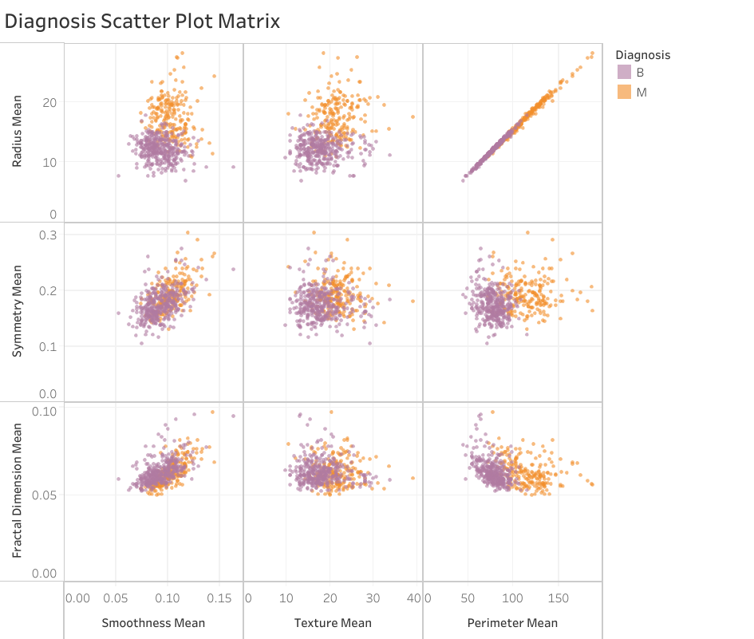
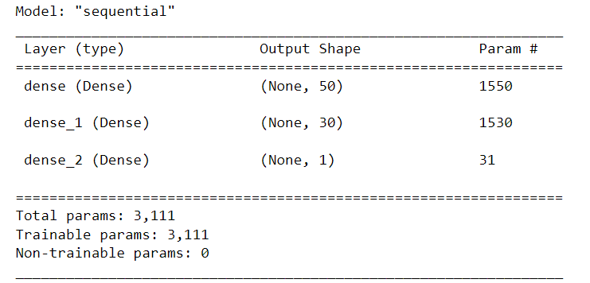

# Breast Cancer Prediction
## Problem Statement  
Breast cancer is one of the most common cancers in women. Our motivation to work on this project
is that cancer research transforms and saves lives. According to the National Cancer Institute, 
from 1992 through 2020, the incidence of new breast cancer almost stays the same while the death
rate has declined steadily. Overall US breast cancer drops 43% in three decades, from 31.6 to 
19.1 per 100,000 population.The purpose of studying cancer is to develop safe and effective 
methods to prevent, detect, diagnose, treat and ultimately cure the collections of diseases we
call cancer. 

## Data:
www.kaggle.com/datasets/yasserh/breast-cancer-dataset 
https://gis.cdc.gov/Cancer/USCS/#/AtAGlance/ 
https://seer.cancer.gov/statfacts/html/breast.html

Our Y variable have two categories - Malignant and Benign 
When we explore and analyze the dataset, we compare the Benign and Malignant data with area 
mean value, we can see Malignant has a higher value mostly. And on the other side, Benign data 
is almost bell shape and thus is a normal distribution.


When we look at the scatter plot matrix, we can see in the third figure, both features - 
radius_mean and parameter_mean are highly dependent on each other and positively correlated. 
In contrast, in the other figures, both variables are kind of independent from each other. 
There is no strong relation among them.

## Goal:
The goal is to classify whether the breast cancer is Benign or Malignant 

Technologies Used: HTML/CSS, Javascript, Jupyter Notebook, Pandas, Python, Matplotlib,
Sklearn, Tensorflow, Lazypredict

## Data Analysis
### Step 1: Preprocess the Data
Read in the breast_cancer.csv to a Pandas DataFrame.
Then replaced the target variable with 1 and 0
```# Replacing the target (y) class
# M = 1 = 212_Count
# B = 0 = 357_Count
data['diagnosis'] = data['diagnosis'].replace({'M': 1,"B": 0})
```
Dropped ```ID``` column.
Then split the preprocessed data into a features array, X, and a target array, y. Used these
arrays and the ```train_test_split function``` to split the data into training and testing 
datasets. Scaled the training and testing features datasets by creating a ```StandardScaler``` 
instance , fitting it to the training data, then using the transform function.

### Step 2: Compile, Train, and Evaluate the Model

Using ```Lazypredict``` we tried to find the best classifying model

Then we used ```RandomForest``` classifier to train and fit the model. We reached 96.5 %
accuracy.
```
forest = RandomForestClassifier(random_state=0)
forest.fit(X_train, y_train)
```

Using ```TensorFlow```, we designed a neural network, or deep learning model, to create a 
binary classification model that can predict if growth will be malignant based on the features 
in the dataset. Once we completed this step, we compiled, trained, and evaluated the binary 
classification model to calculate the model’s loss and accuracy.


Finally, we used ```ADA Boost``` classifier which bumped our accuracy to 97.3%
```# Model classifying using AdaBoost
ADA_Model = AdaBoostClassifier(n_estimators=100, random_state=0)
ADA_Model.fit(X_train, y_train)
```

## Visualizations
### Tableau: 
https://public.tableau.com/shared/GN6J9SYTF?:display_count=n&:origin=viz_share_link 
https://public.tableau.com/app/profile/wei.chen6999/viz/BreastCancerProject--WeiChen/Diagnosiscluster1?publish=yes


## Website
Created a web page, with HTML, magnific pop-up, and slick for fonts and themes. I also had help 
from templatemo style to create a workspace that separates the background to be able to show our
visualizations. I then browsed how to create and change font, font size, and color.
https://simpelaki.github.io/Breast-Cancer-Prediction-Project/ 


Chandrani Ghosh- Francis Rivera- Simpel Osman - Wei Chen  

-------------------------------------------------------------------------------------------------------------------
